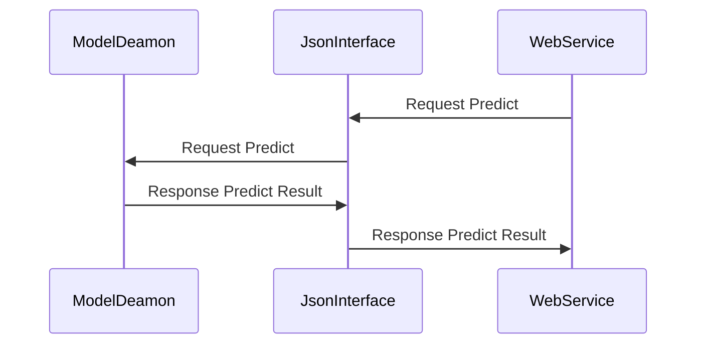

# E-Commerce User Action Prediction

**Authors**: Bang jung nam, Lee Seung jae 
**Date**: 2024/05/28

### Introduction
The purpose of this project is to classify the purchasing behavior of commerce users using deep learning algorithms, and to gain various insights by analyzing the characteristics of these classified users.

### prepare the Dataset 
Before training the model, We prepare data on e-commerce users' visit time, visit day, page views, session duration, traffic source, navigation path, and purchase status. Traffic sources are categorized numerically as bookmark, search ad, external domain, etc. Navigation paths are quantified by summing numbers assigned to the main page, detail page, and product list page.

### Installation
To install these requirements as well as CryptoJELEE, you can run the following commands.

```install
>> git clone https://github.com/CryptoJELEE/ai-program.git
>> cd CryptoJELEE
>> pip install -r requirements.txt
>> pip install .
```

### Compare Model List
We compare the accuracy and precision of each model by training the data using various machine learning algorithms such as logistic regression, decision tree, random forest, SVM, kNN, and XGBoost
1. Logistic Regression
2. Decision Tree
3. Random Forest
4. kNN
5. XGBoost

### Individual Model Execute
```python
python3 ModelCompareFull.py
```

### Data Details
- **Total Data**: 188,602 samples
- **Train Data**: Approximately 80% of the total data 
- **Test Data**: Remaining 20% of the total data
- **Other Test Data**: 5,886 samples

### Note
- We used the SMOTE method to balance the data.

본 연구에서는 다양한 머신러닝 모델을 적용하여 주어진 데이터셋의 예측 성능을 평가하였다. 각 모델의 성능은 정확도(Accuracy), ROC-AUC, 혼동 행렬(Confusion Matrix), 분류 보고서(Classification Report)를 통해 측정하였다. 아래는 각 모델별 성능 평가 결과 및 활용 방안이다.

### 모델별 예측 정확도 비교 

## 1. 로지스틱 회귀 (Logistic Regression)
정확도: 79.2%
ROC-AUC: 87.6%
특징: 해석이 용이하고 빠른 훈련 속도를 가지며, 준수한 정확도와 ROC-AUC 점수를 보인다.
활용 방안:
모델의 해석 가능성이 중요할 때 사용. 예를 들어, 특정 피처가 결과에 미치는 영향을 설명할 필요가 있을 때 적합하다.
비교적 간단한 문제를 해결할 때 유용하다.

## 2. 의사결정나무 (Decision Tree)
정확도: 77.3%
ROC-AUC: 81.9%
특징: 직관적으로 이해하기 쉽고, 시각화가 가능하나 복잡한 데이터에서는 과적합(overfitting) 가능성이 있다.
활용 방안:
데이터의 피처 중요도를 설명할 때 유용하다.
간단한 의사결정을 시각적으로 보여줄 필요가 있을 때 적합하다.

## 3. 랜덤 포레스트 (Random Forest)
정확도: 80.3%
ROC-AUC: 88.5%
특징: 강력한 성능과 과적합 방지 능력을 가지며, 다양한 데이터에 대해 안정적인 성능을 보인다.
활용 방안:
다양한 피처를 가진 복잡한 데이터셋을 처리할 때 적합하다.
피처 중요도를 제공하여 중요한 변수를 식별하는 데 유용하다.

## 4. k-최근접 이웃 (k-NN)
정확도: 76.5%
ROC-AUC: 82.6%
특징: 이해하기 쉽고 비선형 분포도 잘 처리하지만, 대용량 데이터에서 계산 비용이 높다.
활용 방안:
비선형 데이터 분포를 처리할 때 유용하다.
메모리가 충분한 경우 및 실시간 예측이 필요하지 않을 때 적합하다.

## 5. 나이브 베이즈 (Naive Bayes)
정확도: 78.2%
ROC-AUC: 80.5%
특징: 훈련 속도가 빠르고 비교적 간단한 모델로, 독립 가정이 강하지만 많은 경우에 잘 작동한다.
활용 방안:
텍스트 분류와 같은 높은 차원의 데이터에서 유용하다.
속도가 중요한 경우 적합하다.

## 6. 신경망 (Neural Network)
정확도: 80.8%
ROC-AUC: 88.9%
특징: 복잡한 패턴을 잘 학습하지만, 훈련에 시간이 걸리고 많은 데이터가 필요하다.
활용 방안:
복잡한 데이터 패턴을 학습해야 할 때, 예를 들어 이미지나 자연어 처리에 유용하다.
성능이 중요한 경우 및 충분한 데이터와 계산 자원이 있을 때 적합하다.

## 종합 제안
본 연구에서는 다양한 모델의 성능을 비교 분석한 결과, 랜덤 포레스트와 신경망 모델이 가장 높은 성능을 보였다. 따라서 이 두 모델을 주요 모델로 선택하여 활용하는 것이 바람직하다. 또한, 해석 가능성과 성능의 균형이 중요할 경우 로지스틱 회귀나 랜덤 포레스트를, 단순한 구현과 빠른 예측이 필요할 경우 나이브 베이즈를 고려할 수 있다.랜덤포레스트, 신경망 예측모델 기반 앙상블 결과 유의미한 차이 없음.


## Future Direction Using Model

We plan to handle modules for each model as classes and run them as daemons to continuously train. 
Through a separate web service interface, visitor data will be transmitted to extract purchase predictions and probabilities. 
This information will be used to select targets for post-event analysis and for separate marketing initiatives.
- Class Modeling and Deamon Program
- Interface Design
- Integration With WebService 

## MLP E-Commerce User Purchase Prediction Diagram



